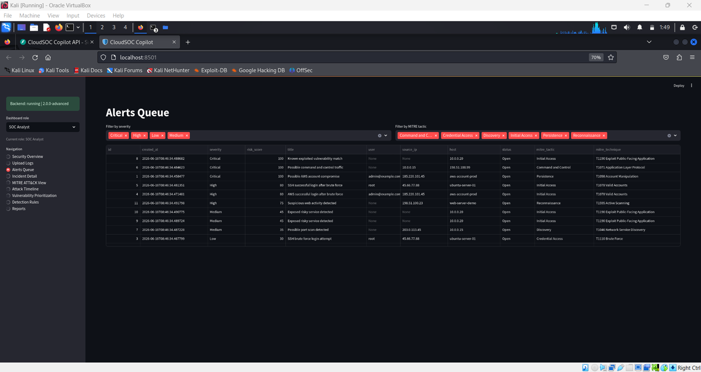
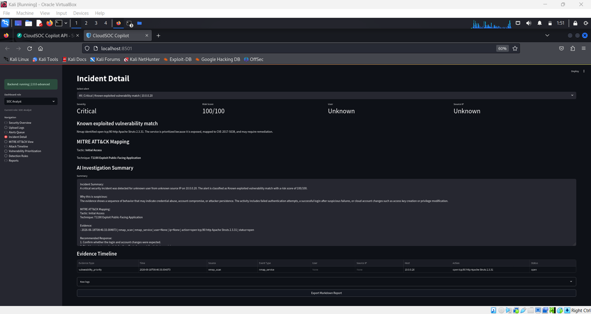
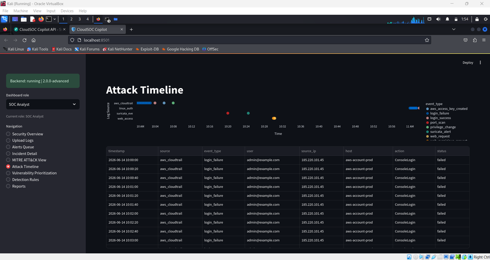
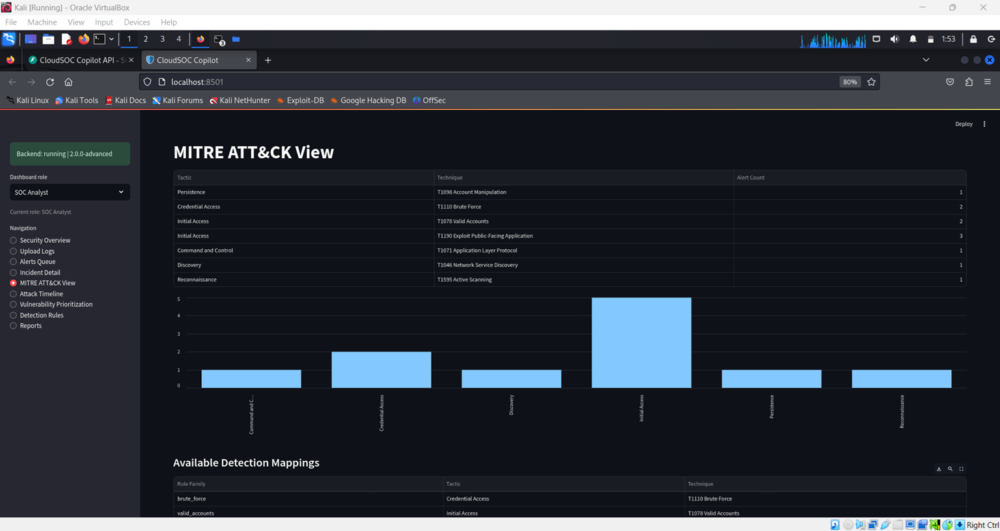
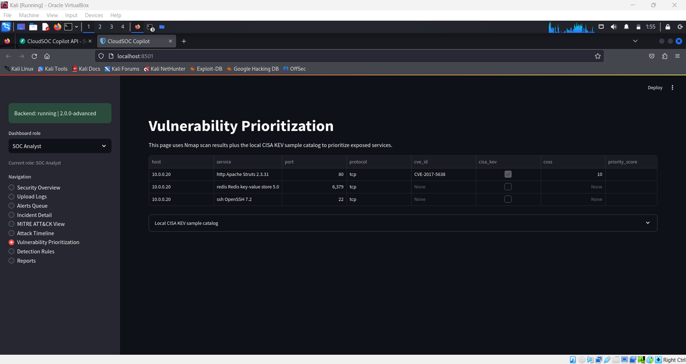
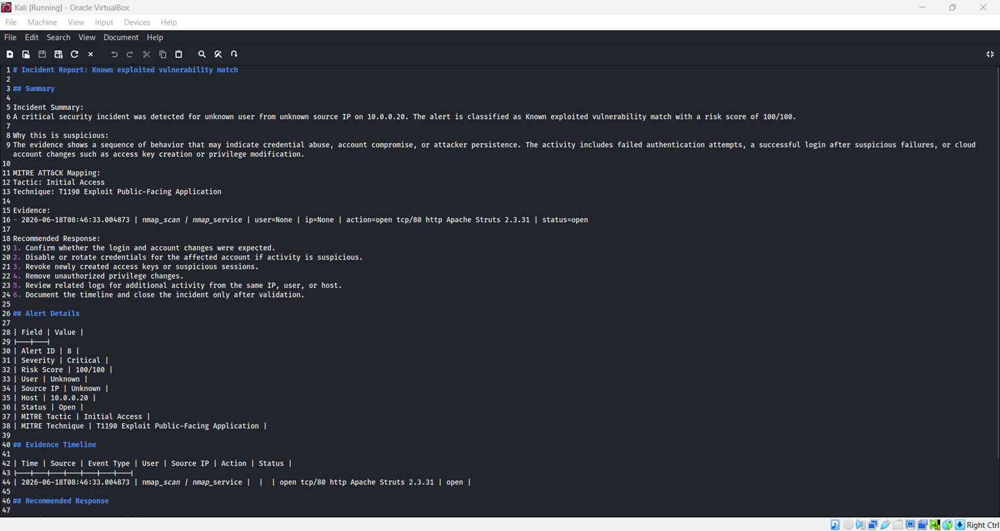

# CloudSOC Copilot

CloudSOC Copilot is an AI-assisted SOC detection and incident response platform designed to help analysts detect, triage, investigate, and document suspicious security activity across multiple log sources.

The project ingests AWS CloudTrail-style logs, Linux SSH authentication logs, Suricata IDS alerts, Nmap scan results, and web access logs. It normalizes raw data into a unified security event format, applies detection and correlation logic, maps alerts to MITRE ATT&CK, prioritizes risky exposed services, and generates analyst-style incident reports.

## Project Goal

The goal of CloudSOC Copilot is to simulate a real Security Operations Center investigation workflow.

Instead of analyzing one log source at a time, the platform connects multiple security data sources into one workflow where an analyst can:

* Upload or load sample logs
* Normalize events into a common format
* Run detection logic
* Review alert severity and risk score
* Analyze related evidence
* View MITRE ATT&CK mapping
* Review attack timelines
* Prioritize vulnerabilities
* Export incident reports

This project was built to demonstrate hands-on skills in SOC analysis, detection engineering, log analysis, incident triage, vulnerability prioritization, and security automation.

## Key Features

* Multi-source log ingestion for AWS CloudTrail-style logs, Linux SSH authentication logs, Suricata IDS alerts, Nmap XML scan results, and Apache/Nginx-style web access logs
* Log normalization into a unified security event format
* Rule-based detection engine for suspicious authentication, IDS, web, cloud, and vulnerability activity
* Event correlation for identifying suspicious activity chains
* Risk scoring based on alert factors and severity logic
* MITRE ATT&CK mapping for major alert categories
* Sigma-style YAML detection rule files for readable detection documentation
* Local CISA KEV sample catalog matching for vulnerability prioritization
* Streamlit dashboard for SOC-style investigation
* Alert queue with severity, risk score, source IP, user, host, and MITRE fields
* Incident detail view with evidence timeline and raw log review
* Attack timeline visualization using Altair
* Vulnerability prioritization view using Nmap results and local KEV context
* AI-style incident summary generation with optional OpenAI API support
* Markdown incident report export
* Role-based dashboard views for SOC Analyst, SOC Manager, and Executive perspectives
* Docker Compose setup for running backend and dashboard services
* Documentation for architecture, setup, detection rules, attack scenarios, cloud deployment, and demo workflow
* Unit tests for detection, advanced parsers, and API flows

## Supported Log Sources

| Source                        | Format                   | Purpose                                                                                     |
| ----------------------------- | ------------------------ | ------------------------------------------------------------------------------------------- |
| AWS CloudTrail-style logs     | JSON                     | Detect cloud login failures, successful logins, access key creation, and privilege activity |
| Linux SSH authentication logs | Syslog-style `.log`      | Detect SSH brute-force attempts and successful logins after failures                        |
| Suricata IDS alerts           | `eve.json`, JSON, NDJSON | Detect IDS alerts, command-and-control indicators, and port scan activity                   |
| Nmap scan results             | XML                      | Identify exposed services, risky ports, and CVE-style vulnerability matches                 |
| Web access logs               | Apache/Nginx-style logs  | Detect suspicious web requests and exploitation patterns                                    |

## Detection Coverage

CloudSOC Copilot can detect and triage:

1. AWS console login failure bursts
2. SSH brute-force login attempts
3. Successful login after repeated failed attempts
4. Possible AWS account compromise activity
5. AWS access key creation after suspicious login behavior
6. AWS privilege change activity after suspicious login behavior
7. Suricata high-severity IDS alerts
8. Possible command-and-control traffic from IDS alerts
9. Port scan activity from Suricata signatures
10. Known exploited vulnerability matches using a local CISA KEV sample catalog
11. Risky exposed services from Nmap scan results
12. Suspicious web reconnaissance and exploitation paths

## Tech Stack

| Layer                   | Technology                                 |
| ----------------------- | ------------------------------------------ |
| Backend API             | Python, FastAPI                            |
| Dashboard               | Streamlit                                  |
| Database                | SQLite                                     |
| ORM                     | SQLAlchemy                                 |
| Detection Logic         | Python rule-based detection engine         |
| Detection Documentation | Sigma-style YAML rules                     |
| IDS Data                | Suricata `eve.json`                        |
| Vulnerability Data      | Nmap XML, local CISA KEV sample catalog    |
| MITRE Mapping           | MITRE ATT&CK tactics and techniques        |
| Timeline Visualization  | Altair                                     |
| Reporting               | Markdown                                   |
| Optional AI Summary     | OpenAI API or local template-based summary |
| Deployment              | Docker Compose                             |

## Architecture

```text
Raw Logs and Scan Results
        |
        v
Parser Router
        |
        v
Source-Specific Parsers
        |
        v
Unified Security Event Format
        |
        v
SQLite Event Storage
        |
        v
Detection and Correlation Engine
        |
        v
Risk Scoring and MITRE ATT&CK Mapping
        |
        v
Alert Queue and Incident Evidence
        |
        v
Streamlit SOC Dashboard
        |
        v
Markdown Incident Report Export
```

## Project Structure

```text
cloudsoc-copilot/
│
├── backend/
│   ├── app/
│   │   ├── main.py
│   │   ├── database.py
│   │   ├── models.py
│   │   ├── schemas.py
│   │   │
│   │   ├── parsers/
│   │   │   ├── aws_parser.py
│   │   │   ├── linux_auth_parser.py
│   │   │   ├── suricata_parser.py
│   │   │   ├── nmap_parser.py
│   │   │   ├── web_access_parser.py
│   │   │   └── parser_router.py
│   │   │
│   │   ├── detection_engine/
│   │   │   ├── detector.py
│   │   │   └── rules.py
│   │   │
│   │   ├── risk_engine/
│   │   │   └── risk_score.py
│   │   │
│   │   ├── ai_engine/
│   │   │   └── summary_generator.py
│   │   │
│   │   ├── report_generator/
│   │   │   └── markdown_report.py
│   │   │
│   │   ├── threat_intel/
│   │   │   └── cisa_kev.py
│   │   │
│   │   └── data/
│   │       └── cisa_kev_sample.json
│   │
│   ├── sample_logs/
│   │   ├── aws_compromise.json
│   │   ├── linux_ssh_bruteforce.log
│   │   ├── suricata_eve.json
│   │   ├── nmap_scan.xml
│   │   └── web_access.log
│   │
│   ├── tests/
│   ├── Dockerfile
│   └── requirements.txt
│
├── dashboard/
│   ├── streamlit_app.py
│   ├── Dockerfile
│   └── requirements.txt
│
├── detections/
│   ├── aws/
│   ├── linux/
│   ├── suricata/
│   ├── vulnerability/
│   └── web/
│
├── docs/
│   ├── architecture.md
│   ├── detection_rules.md
│   ├── setup_guide.md
│   ├── attack_scenarios.md
│   ├── advanced_features.md
│   ├── cloud_deployment.md
│   ├── demo_video_script.md
│   └── demo_video_checklist.md
│
├── deployment/
│   └── render.yaml
│
├── reports/
├── docker-compose.yml
├── run_local.sh
├── .env.example
└── README.md
```

## Dashboard Views

The Streamlit dashboard includes multiple SOC-style views:

## Screenshots

### Alert Queue


### Incident Details


### Attack Timeline


### MITRE ATT&CK View


### Vulnerability Prioritization


### Incident Report Export


### SOC Analyst View

* Security overview
* Log upload
* Alerts queue
* Incident detail
* MITRE ATT&CK view
* Attack timeline
* Vulnerability prioritization
* Detection rules
* Reports

### SOC Manager View

* Security overview
* Alerts queue
* MITRE ATT&CK view
* Attack timeline
* Vulnerability prioritization
* Reports

### Executive View

* Executive summary
* Reports

Note: Role-based views are implemented as a dashboard role selector for demonstration purposes. This is not a full authentication or access-control system.

## Example Investigation Workflow

1. Start the FastAPI backend.
2. Start the Streamlit dashboard.
3. Load the advanced demo logs.
4. Run the detection engine.
5. Review alerts in the alert queue.
6. Open an incident and review evidence.
7. Check MITRE ATT&CK tactic and technique mapping.
8. Review the attack timeline.
9. Open vulnerability prioritization to review risky exposed services.
10. Export a Markdown incident report.

## Sample Detection Scenarios

### SSH Brute Force

Linux SSH authentication logs are parsed to detect repeated failed login attempts from the same source IP address.

### Successful Login After Failures

The platform detects cases where a successful login occurs after multiple failed login attempts from the same source IP or user.

### AWS Account Compromise Pattern

CloudTrail-style logs are correlated to identify repeated login failures, a successful login, and sensitive IAM activity such as access key creation or privilege changes.

### Suricata IDS Alert Review

Suricata `eve.json` alerts are parsed and converted into normalized events for SOC-style alert triage.

### Port Scan Detection

Suricata scan-like signatures are used to identify possible reconnaissance and network service discovery activity.

### Suspicious Web Activity

Apache/Nginx-style web access logs are analyzed for suspicious paths and exploitation patterns such as `.env`, `wp-login.php`, `phpmyadmin`, path traversal, and SQL injection-style probes.

### Vulnerability Prioritization

Nmap XML scan results are parsed to identify exposed services, risky ports, and CVE-style matches. A local CISA KEV sample catalog is used to prioritize known exploited vulnerability examples.

## API Endpoints

| Endpoint                          | Method | Purpose                                   |
| --------------------------------- | ------ | ----------------------------------------- |
| `/`                               | GET    | Health check and project status           |
| `/api/upload`                     | POST   | Upload supported log files                |
| `/api/demo/reset`                 | POST   | Reset demo database                       |
| `/api/demo/load-samples`          | POST   | Load included sample logs                 |
| `/api/detect/run`                 | POST   | Run detection engine                      |
| `/api/events`                     | GET    | View normalized events                    |
| `/api/timeline`                   | GET    | View timeline events                      |
| `/api/alerts`                     | GET    | View generated alerts                     |
| `/api/alerts/{alert_id}`          | GET    | View alert detail and evidence            |
| `/api/alerts/{alert_id}/report`   | POST   | Generate Markdown incident report         |
| `/api/reports/{filename}`         | GET    | Download generated report                 |
| `/api/metrics`                    | GET    | View dashboard metrics                    |
| `/api/mitre/coverage`             | GET    | View MITRE ATT&CK coverage                |
| `/api/detections/rules`           | GET    | View Sigma-style YAML detection rules     |
| `/api/vulnerabilities/priorities` | GET    | View vulnerability prioritization results |
| `/api/threat-intel/cisa-kev`      | GET    | View local CISA KEV sample catalog        |

## Run Locally

### 1. Clone the repository

```bash
git clone https://github.com/dhruviil19/cloudsoc-copilot.git
cd cloudsoc-copilot
```

If the repository has not been renamed to `cloudsoc-copilot`, replace the URL above with the current repository URL.

### 2. Create and activate a virtual environment

```bash
python3 -m venv .venv
source .venv/bin/activate
```

For Windows PowerShell:

```powershell
python -m venv .venv
.venv\Scripts\Activate.ps1
```

### 3. Install backend dependencies

```bash
cd backend
pip install -r requirements.txt
```

### 4. Start the backend API

```bash
uvicorn app.main:app --reload --port 8000
```

Open the FastAPI docs:

```text
http://localhost:8000/docs
```

### 5. Start the dashboard in a second terminal

```bash
cd cloudsoc-copilot
source .venv/bin/activate
cd dashboard
pip install -r requirements.txt
streamlit run streamlit_app.py
```

Open the dashboard:

```text
http://localhost:8501
```

## Run with Docker Compose

From the project root:

```bash
docker compose up --build
```

Open:

```text
Dashboard: http://localhost:8501
Backend API: http://localhost:8000
API Docs: http://localhost:8000/docs
```

## Unit Tests

Run tests from the backend folder:

```bash
cd backend
pytest -q
```

Current verification result:

```text
5 passed
```

## Optional AI Summary

CloudSOC Copilot works without an OpenAI API key by using a local template-based SOC summary generator.

If an OpenAI API key is configured, the platform can optionally generate more detailed AI-assisted incident summaries.

For Linux/macOS:

```bash
export OPENAI_API_KEY="your_api_key_here"
```

For Windows PowerShell:

```powershell
$env:OPENAI_API_KEY="your_api_key_here"
```

Then restart the backend.

## CISA KEV Note

This project includes a small local CISA KEV sample catalog for demonstration purposes:

```text
backend/app/data/cisa_kev_sample.json
```

This is not a live CISA KEV feed. For production-style use, the sample catalog should be replaced with the latest official CISA KEV data while keeping the same `cve_id` field format.

## Sigma-Style Rules Note

The repository includes Sigma-style YAML detection rule files under:

```text
detections/
```

These files are used to document detection logic in a readable security-rule format. The main detection execution is implemented through the Python detection engine.

## Cloud Deployment Note

A cloud deployment template and guide are included for portfolio demonstration and future deployment planning.

Actual deployment requires creating cloud services, configuring environment variables, and connecting the dashboard to the backend service URL.

## Skills Demonstrated

This project demonstrates practical skills in:

* SOC investigation
* Cybersecurity analysis
* Detection engineering
* Log parsing and normalization
* Incident triage
* Vulnerability prioritization
* Network security monitoring
* IDS alert analysis
* MITRE ATT&CK mapping
* Python backend development
* FastAPI API development
* Streamlit dashboard development
* SQLite database usage
* Docker Compose deployment
* Security reporting and documentation

## Disclaimer

CloudSOC Copilot is a portfolio and educational cybersecurity project built using sample and simulated data.

No real credentials, private cloud data, production logs, or sensitive information are included in this repository.

The project is intended to demonstrate SOC investigation concepts, detection engineering, vulnerability prioritization, and incident response workflows.
